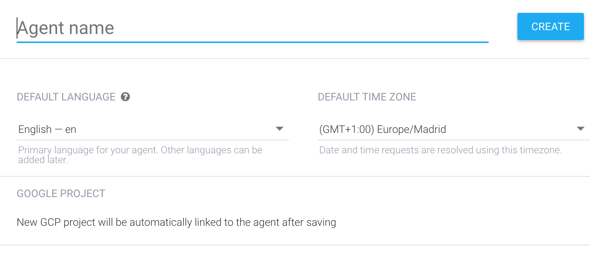
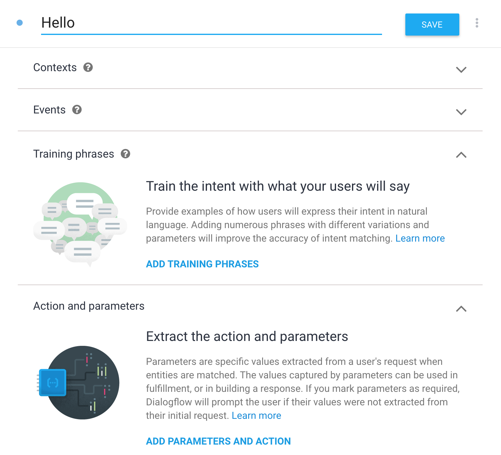
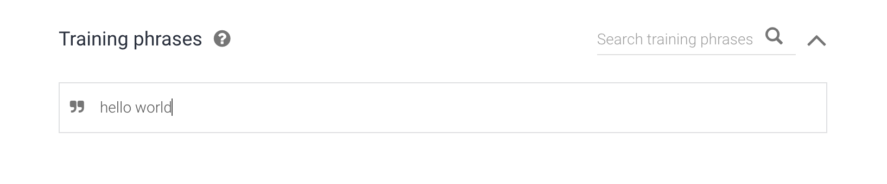

#Creating a Hello World Agent for your Google Assistant in Dialogflow
  
  

##General
Dialogflow is a web based application, which allows you to easily built natural conversations for voice- and text-based interfaces like chat bots or voice apps. It is powered by AI and Google's machine learning. It is connectible with your own Websites, Home Assistants like the Google Home Assistant, Amazon’s Alexa or even with the Facebook Messenger.

##Start with Dialogflow
Go to [Dialogflow's website](https://dialogflow.com/ "Yes, this link.") and sign in with your Google Account.
After signing in you will be directed to Dialogflow’s overview.

##Create a new agent 
Create a new agent. Type in __"Hello_World"__ as your agent name. You can also set up a different language for your conversation and another timezone or even add your agent to an existing Google Project.

##Intent menu
After creating your agent you will be directed to the Intent window. You are able to see two prebuilt Intents.
Delete them by clicking the trash bin on the right side of the selected Intent.

##Create a new Intent
Click "Create Intent". You will get an overview of your Intents. Give your Intent a name, for example __"Hello"__. The Intent menu is divided into six categories: Contexts, Events, Training phrases, Actions and parameters, Responses and Fulfillment. Each category introduces itself in small paragraphs explaining what it is capable of.

 
Go to Training phrases. Add the phrase __"hello world"__ to your training phrases.  

 Then go to Responses and type a response like __"Hi, new to this World?"__ 
 
 

Save your entries by clicking the Save button on the top. On the right side of your screen is the console. There, you can check if everything works like you want to. Next, type in the Training phrase. When you’ve done everything correctly, the default response has to be the one you’ve already typed in Responses.  

##Connect with Google Assistant 
So you’ve built your first agent for a voice interface. But wouldn’t it be nice to actually try it with your Google Home or on your Google Assistant app? 
Piece of cake.  
 Navigate to the left side and click on Integrations. Select Google Assistant. A pop up window will come up, asking you to change and confirm your settings. Afterwards, click the Test button.  
A new Tab opens up the Actions on Google Simulator. Type or say __"Talk to my test app"__ by interacting with the bottom chat field. 

Your Google Account that is linked to a Google Assistant is able to start your agent too.  
I would recommend to change the Display name in Actions on Google. 
To do that, click the Invocation button on the right side of the window. Change the Display name to __"Hello World"__ and save your changes.  
Then start your Google Assistant app on your smartphone or use your Google Home by saying __"Okay Google, talk to Hello World"__.

If you followed the instructions correctly, your agent is ready for use.  
Have fun!

